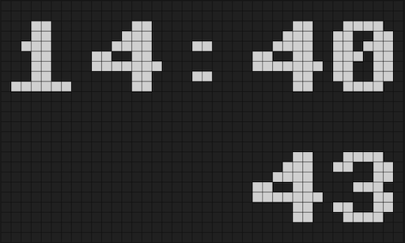

## flipdots_clock

This my entry to the [Flutter Clock challenge](https://flutter.dev/clock).
 
A flip dot design that shows time, date and temperature. Built around the [`spin_widget.dart`](flipdots_clock/lib/spin_widget.dart) widget.

## flutter_clock_helper

`flutter_clock_helper` is required to be used for the challenge.
